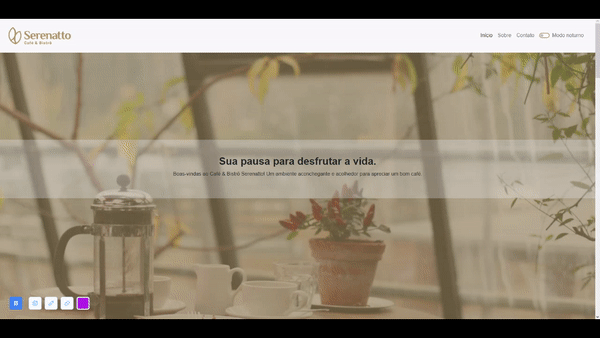

## Café & Bistrô Serenatto ☕ 

Projeto criado junto à formação de Bootstrap da [Alura](https://www.alura.com.br), para exercitar os conhecimentos no framework. O projeto simula a página de uma cafeteria e seu design é responsivo para celulares, tablets e desktops.

Conta com offcanvas, modais, efeito Parallax e modo noturno!

🔗 [Clique aqui para acessar](https://alineguiseline.github.io/serenatto-coffee/)

